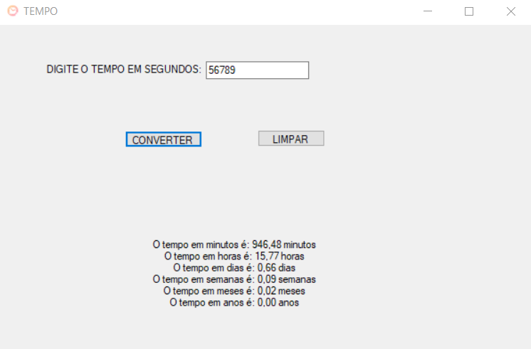

# CONVERSOR DE TEMPO WINF
👨‍🏫CONVERTE SEGUNDOS EM MINUTOS, HORAS, DIAS, SEMANAS, MESES E ANOS COM WINFORMS.

  

## DESCRIÇÃO:
Este aplicativo WinForms é projetado para converter um valor de tempo em segundos para várias outras unidades de tempo, incluindo minutos, horas, dias, semanas, meses e anos. Ele fornece uma interface simples e intuitiva para o usuário inserir o valor em segundos e obter as conversões desejadas. O aplicativo também possui validações de entrada para garantir que os dados fornecidos sejam válidos e exibirá mensagens de erro apropriadas em caso de entradas inválidas.

## FUNCIONALIDADES:
1. **Conversão de Tempo**:
   - **Entrada**: O usuário insere um valor em segundos.
   - **Cálculos**: O aplicativo converte o valor inserido em:
     - Minutos
     - Horas
     - Dias
     - Semanas
     - Meses (aproximados com 30 dias)
     - Anos (aproximados com 365 dias)
   - **Resultado**: Exibe os valores convertidos na interface.

2. **Validação de Entrada**:
   - Verifica se o campo de entrada não está vazio.
   - Verifica se o valor inserido é numérico.

3. **Limpeza de Campos**:
   - Permite ao usuário limpar o campo de entrada e o resultado com um botão de "LIMPAR".

## EXECUTANDO O PROJETO:
### ABRINDO NO VISUAL STUDIO:
- Abra o projeto `./CODIGO` no Visual Studio:
  1. Abra o Visual Studio.
  2. Clique em `File` > `Open` > `Project/Solution`.
  3. Navegue até o diretório `./CODIGO`.
  4. Selecione o arquivo da solução (`.sln`) do projeto e clique em `Open`.
  5. No Solution Explorer, abra o arquivo `Program.cs` para ver o código-fonte.

#### COMPILANDO E EXECUTANDO O PROJETO:
1. Pressione `Ctrl + Shift + B` para compilar o projeto.
2. Após a compilação, pressione `Ctrl + F5` para executar o projeto sem depuração.

### ABRINDO O EXECUTÁVEL:
- Abra o executável em `CODIGO/Tempo/bin/Debug/Tempo.exe`:
  1. Abra o Explorador de Arquivos.
  2. Navegue até o diretório `CODIGO/Tempo/bin/Debug`.
  3. Dê um duplo clique no arquivo `Tempo.exe` para executar o aplicativo.

### INTERAGINDO COM APP:
1. **Iniciar o Programa**:
   - Abra o aplicativo. A janela principal (`Form1`) será exibida.

2. **Inserir o Valor em Segundos**:
   - Digite o valor em segundos no campo de texto (`Valor`).

3. **Converter o Tempo**:
   - Clique no botão "CONVERTER" (`converterTempo`).
   - O aplicativo realizará as conversões e exibirá os resultados no campo de texto (`Resultado`).

4. **Limpar os Campos**:
   - Para limpar os campos de entrada e de resultado, clique no botão "LIMPAR" (`Limpar`).

## NÃO SABE?
- Entendemos que para manipular arquivos nas linguagens relacionadas, é necessário possuir conhecimento nessas áreas. Para auxiliar nesse aprendizado, oferecemos cursos gratuitos disponíveis:
* [CURSO DE WINFORMS](https://github.com/VILHALVA/CURSO-DE-WINFORMS)
* [CURSO DE C#](https://github.com/VILHALVA/CURSO-DE-C-SHARP)
* [CONFIRA MAIS CURSOS](https://github.com/VILHALVA?tab=repositories&q=+topic:CURSO)

## CREDITOS:
- [PROJETO FEITO PELO VILHALVA](https://github.com/VILHALVA)
- [PROJETO BASEADO NO "CALCULADORA DE TEMPO"](https://github.com/VILHALVA/CALCULADORA-DE-TEMPO)

